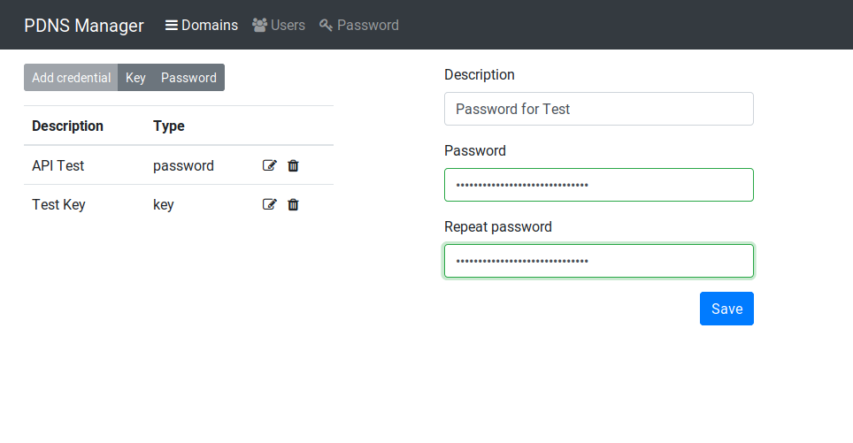

type: doc

## API

PDNS Manager features a powerful API which enables you to update 
records pragmatically whilst also providing some helper functions.

This can be used for example to achieve a Dynamic DNS service

### Update via GET request

The most simple API is to update a record via a simple GET request. 
Therefore you must create the record you with to update.

The next step is to enable remote access for that record. Therefore 
click on the "share" symbol, the last icon in the record row.

Then click on add password. Enter a description for that API access and 
supply a password. Repeat the password and confirm it with *Add*.



Remember the ID of your new remote access you need it in the api call.

Now everything is configured to update the record remotely, to do that 
make a request to:
```markdown
https://dns.example.com/api/remote.php?domain=<domain>&id=<id>&password=<pass>&content=<content>
```

Where:

* &lt;domain&gt;: is the complete name of your record
* &lt;id&gt;: is the remote access id which you remember from above
* &lt;pass&gt;: is the password you added
* &lt;content&gt;: is the new content of your record

### Post API with signature

PDNS Manager also has a API which uses asymmetric cryptography as 
authentication method. This API is used via HTTP POST requests.

A client for that API implemented in a simple bash script is available. 
The client is described first, afterwards the protocol is described.

#### Using the client software

To get the client you must have git installed. If this is not the case 
you can do that for Debian using:

```bash
sudo apt-get install git
```

The client depends on jq and curl which can be installed as follows:
```bash
sudo apt-get install jq curl
```

Now you can clone the repository in a directory of your choice, and 
change into the cloned repository.

```bash
git clone https://github.com/loewexy/pdns-client
cd pdns-client
```

In the next step you must generate a RSA keypair using:

```bash
./pdns-keygen
```

This creates two files: *pdns.private.pem* and *pdns.public.pem*

Get the public key using cat:

```bash
cat pdns.public.pem
```

Copy the output to the clipboard. Now go to PDNS Manager and add the 
record you want to update. Click on the "share" symbol, the last icon in
the record row.

On the following page press *Add key*. Enter some description and paste 
the public key from the clipboard into the text field.

Confirm your inputs with *Add*. Remember the ID which is assigned to 
your new remote permission.

Now back on your machine which should do the update you can call the 
client with data of your choice like that:

```bash
./pdns-client -s https://dns.example.com/ -d <domain> -i <id> -c <content>
```

Where:

* &lt;domain&gt;: is the complete name of your record
* &lt;id&gt;: is the remote access id which you remember from above
* &lt;content&gt;: is the new content of your record

This should update the data as you requested.

You can get more options of pdns-keygen and pdns-client through the -h 
option, which will give you some hints what you can do.

#### API description

The POST API is very simple. You need a RSA keypair and you must be 
able to sign data with it.

The first action you do is to send a JSON like the following as POST 
data to the URL *https://dns.example.com/api/remote.php?getNonce*.

```json
{
    domain="test.example.com",
    id=1,
    content="1.2.3.4"
}
```

Where:

* domain: is the complete name of your record
* id: is the remote access id which you remember from above
* content: is the new content of your record

You get a JSON like the following:

```json
{
    nonce: "SnXuDd0CKwayBjwiWyAUWCcqG1B/4bO+QSJK6sQ1ehU="
}
```

Now you have to concatenate the domain, the id, the content and the 
received nonce. Sign this data with SHA512 using your private key and 
base64 encode the signature. Add the result to the first JSON you sent 
like the following (signature is shortend for better readability):

```json
{
    domain="test.example.com",
    id=1,
    content="1.2.3.4",
    signature="YIRJppYL55dOuC[...]u0sXYgClo="
}
```

Sent this as POST data to
*https://dns.example.com/api/remote.php?updateRecord*.
